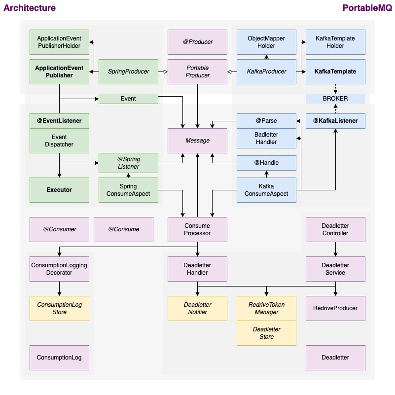

# PortableMQ

Agile, Not Hasty.

An asynchronous messaging framework for a Spring framework.  
Wouldn't it be nice if the broker change was as easy as moving from MySQL to Postgres?  
Supports Lazy & Agile MSA through SpringEvent and Kafka's Portable Service Abstraction.

by josh910830@gmail.com

---


---

- [Install](#Install)
- [Usage](#Usage)
- [Architecture](#Architecture)
- [Premise](#Premise)
- [Release](#Release)

---

## Install

### build.gradle

`latest: 1.1.3`

```groovy
repositories {
    maven { url 'https://jitpack.io' }
}

dependencies {
    implementation 'com.github.josh910830:portable-mq:$version'
}
```

### @Configuration

```java
@EnablePortableMQ
@SpringBootApplication
public class App { /**/ }

// optional
@Configuration
public class Config {
    @Bean // auto-config: ThreadPoolExecutor(3)
    public Executor portableMqExecutor() { /**/ }
}
```

```java
@SpringBootTest
@Import(TestConfig.class)
public class ApplicationTests { /**/ }

// optional
@TestConfiguration
public class TestConfig {
    @Bean // switch off dispatch to @SpringListener
    public SpringListenerSwitch springListenerSwitch() {
      return new TestSpringListenerSwitch();
    }
}
```

### application.yml

```yml
spring:
  kafka:
    consumer:
      group-id: groupId # always. SpringListener also has groupId.
      bootstrap-servers: localhost:9092 # on use Kafka.
    producer:
      bootstrap-servers: localhost:9092 # on use Kafka.
    listener:
      ack-mode: manual # on use Kafka. Should be manual.
```

## Usage

@see [PortableMQ-Demo](https://github.com/josh910830/portable-mq-demo)

### Producer

```java
public class ExampleService {

    // Implement bean extends SpringProducer or KafkaProducer.
    private final PortableProducer<ExampleMessage> exampleProducer;

    public void process() {
        // ...
        exampleProducer.produce(new ExampleMessage("id", "content"));
    }

}
```

```java
@Producer(topic = "example") // No need to impl method.
public class SpringExampleProducer implements SpringProducer<ExampleMessage> {}
```

```java
@Producer(topic = "example") // No need to impl method.
public class KafkaExampleProducer implements KafkaProducer<ExampleMessage> {}
```

### Consumer

```java
@Consumer
public class SpringExampleConsumer {

    @Consume(useDeadletter = true) // Deadletter is re-drivable by link with token.
    @SpringListener(topic = "example", groupId = "example-consumer")
    public void consume(ExampleMessage message) {
        // impl
    }

}
```

```java
@Consumer
public class KafkaExampleConsumer {

    @Consume(useBadletter = true) // Badletter is im-parsable. If use store raw, else skip.
    @KafkaListener(topics = "example") // Just trigger. -> @Parse -> @Handle -> ack.
    public void consume(String data, Acknowledgment ack) {}

    @Parse // optional. ObjectMapper try parse string to @Handle param as default.
    public ExampleMessage parse(String data) { /**/ }

    @Handle
    public void handle(ExampleMessage message) {
        // impl
    }

}
```

@see
[ConsumeProcessor](./src/main/kotlin/com/github/josh910830/portablemq/core/consumer/ConsumeProcessor.kt) /
[SpringMessageEventDispatcher](./src/main/kotlin/com/github/josh910830/portablemq/spring/event/SpringMessageEventDispatcher.kt),
[SpringConsumerAspect](./src/main/kotlin/com/github/josh910830/portablemq/spring/consumer/SpringConsumeAspect.kt) /
[KafkaConsumerAspect](./src/main/kotlin/com/github/josh910830/portablemq/kafka/consumer/KafkaConsumeAspect.kt),
[KafkaMethodResolver](./src/main/kotlin/com/github/josh910830/portablemq/kafka/consumer/KafkaMethodResolver.kt)

### API

**Deadletter**

<details>
<summary>find</summary>

```http request
GET /portable-mq/deadletter/
    ?topic=topic
    &redriven=false
```

```json
[
  {
    "id": "deadletterId",
    "topic": "topic",
    "message": {
      "id": "messageId",
      "etc": "data"
    },
    "broker": "KAFKA",
    "redriven": false
  }
]
```

</details>

<details>
<summary>findById</summary>

```http request
GET /portable-mq/deadletter/{deadletterId}
```

```json
{
  "id": "deadletterId",
  "topic": "topic",
  "message": {
    "id": "messageId",
    "etc": "data"
  },
  "broker": "KAFKA",
  "redriven": false
}
```

</details>

<details>
<summary>redrive</summary>

```http request
POST /portable-mq/deadletter/redrive
    ?deadletterId=deadletterId
```

```json
{
  "deadletterId": "deadletterId",
  "success": true,
  "error": null
}
```

</details>


<details>
<summary>redriveBatch</summary>

```http request
POST /portable-mq/deadletter/redrive-batch
    ?deadletterIds=id1,id2
```

```json
[
  {
    "deadletterId": "id1",
    "success": true,
    "error": null
  },
  {
    "deadletterId": "id2",
    "success": false,
    "error": "errorMessage"
  }
]
```

</details>

<details>
<summary>redriveAll</summary>

```http request
POST /portable-mq/deadletter/redrive-all
```

```json
[
  {
    "deadletterId": "id1",
    "success": true,
    "error": null
  }
]
```

</details>

<details>
<summary>redriveToken</summary>

```http request
GET /portable-mq/deadletter/redrive-token
    ?deadletterId=deadletterId
    &redriveToken=redriveToken
```

```json
{
  "deadletterId": "deadletterId",
  "success": true,
  "error": null
}
```

</details>

<details>
<summary>drop</summary>

```http request
DELETE /portable-mq/deadletter/drop
    ?deadletterId=deadletterId
```

```json
{
  "deadletterId": "deadletterId",
  "success": true,
  "error": null
}
```

</details>

<details>
<summary>dropBatch</summary>

```http request
DELETE /portable-mq/deadletter/drop-batch
    ?deadletterIds=id1,id2
```

```json
[
  {
    "deadletterId": "id1",
    "success": true,
    "error": null
  },
  {
    "deadletterId": "id2",
    "success": false,
    "error": "errorMessage"
  }
]
```

</details>

<details>
<summary>dropRedriven</summary>

```http request
DELETE /portable-mq/deadletter/drop-redriven
```

```json
[
  {
    "deadletterId": "id1",
    "success": true,
    "error": null
  }
]
```

</details>

<details>
<summary>clear</summary>

```http request
DELETE /portable-mq/deadletter/clear
```

</details>


**Badletter**

<details>
<summary>find</summary>

```http request
GET /portable-mq/badletter/
    ?topic=topic
```

```json
[
  {
    "id": "badletterId",
    "topic": "topic",
    "data": "rawMessage",
    "broker": "KAFKA"
  }
]
```

</details>

<details>
<summary>findById</summary>

```http request
GET /portable-mq/badletter/{badletterId}
```

```json
{
  "id": "badletterId",
  "topic": "topic",
  "data": "rawMessage",
  "broker": "KAFKA"
}
```

</details>

<details>
<summary>drop</summary>

```http request
DELETE /portable-mq/badletter/drop
    ?badletterId=badletterId
```

```json
{
  "badletterId": "badletterId",
  "success": true,
  "error": null
}
```

</details>

<details>
<summary>dropBatch</summary>

```http request
DELETE /portable-mq/badletter/drop-batch
    ?badletterIds=id1,id2
```

```json
[
  {
    "badletterId": "id1",
    "success": true,
    "error": null
  },
  {
    "badletterId": "id2",
    "success": false,
    "error": "errorMessage"
  }
]
```

</details>

<details>
<summary>clear</summary>

```http request
DELETE /portable-mq/badletter/clear
```

</details>

## Architecture



## Premise

### Stable Broker

Asynchronous message queues leverage brokers to reduce the runtime coupling of producers and consumers.  
However, if the broker's stability is not guaranteed, the overall system coupling will rather increase.  
Since Kafka is composed of clusters to provide sufficient reliability, PortableMQ not consider broker failure.

### Not Partitioned

To prevent message loss, commit must be made after the consumer has finished working.  
However, if there are messages that cannot be processed, clogging will occur and operation will be down.  
So, PortableMQ utilized the deadletter, this means that outstanding messages will be processed later.  
Therefore, the order between messages within the partition is not guaranteed.

## Release

### `1.2.0`: Coming Soon

- Support Variant Type between `SpringProducer` and `@SpringListener`.
  - Using `ObjectMapper`, convert `ProduceMessage` -> `String` -> `ConsumerMessage`.
  - `Badletter` cares exception on parsing `ConsumerMessage`.

### `1.1.3`: 2023/05/27

- `SpringListenerSwitch` for Test
  - Test code should not care context out of boundary on asynchronous communication.
  - Register `TestSpringListenerSwitch` as bean, to switch off dispatch message to Consumer.

### `1.1.2`: 2023/05/23

- Named Executor with Auto Configuration
  - `Executor` for `SpringMessageEventDispatcher` had been duplicated on `@EnableScheduling`.
  - Qualify bean by name `portableMqExecutor` and set `ThreadPoolExecutor(3)` as default.


### `1.1.0`: 2023/05/17

- Initial Release
